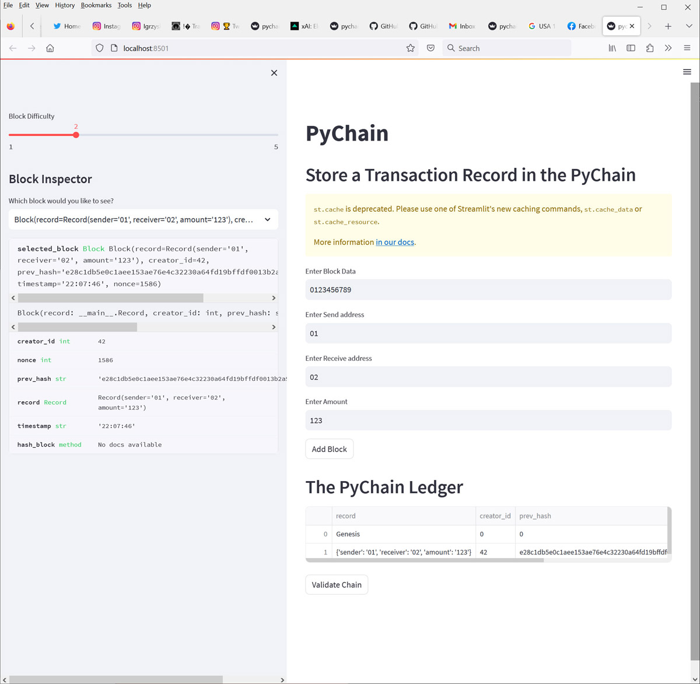
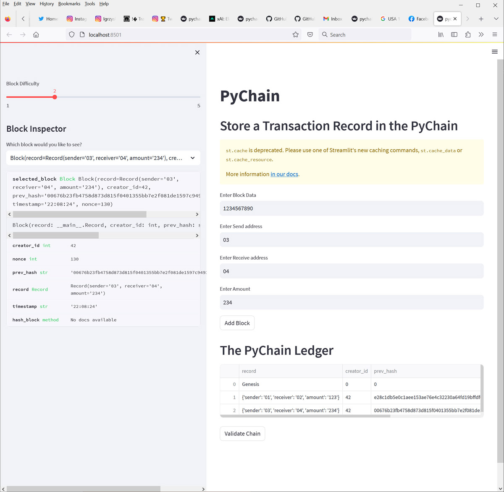
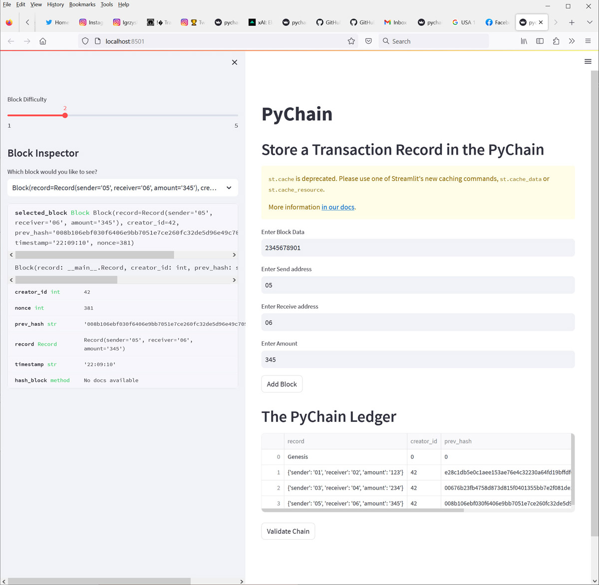
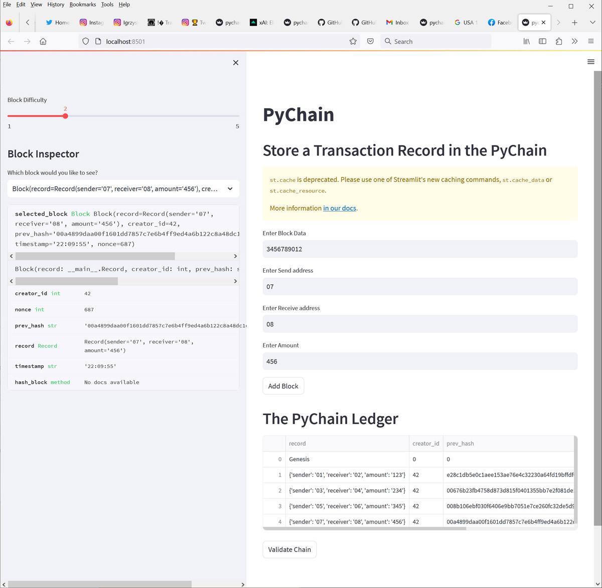
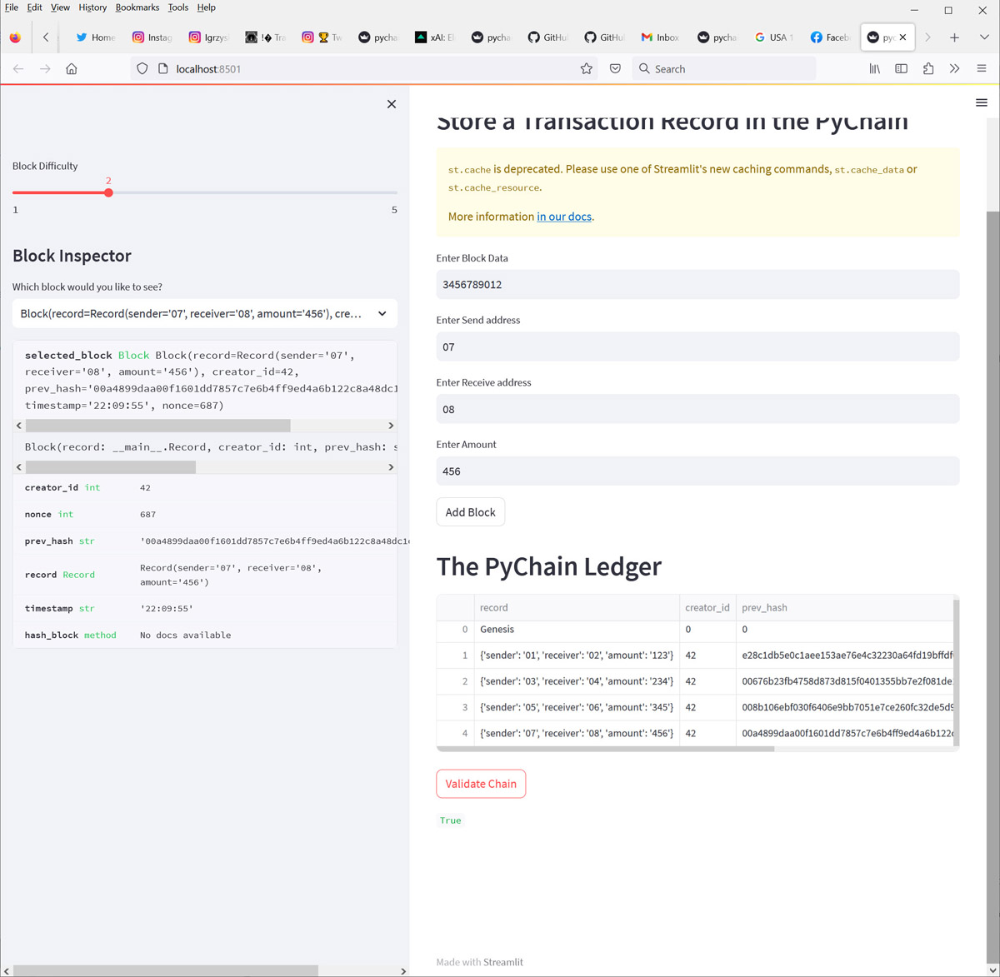

# Module-18-Challenge

FinTech Bootcamp Module 18 Challange due July 23, 2023

# Challenge - Store a Transaction Record in the PyChain

Store a Transaction Record in the PyChain using Streamlit

## Analysis

We are building a blockchain-based ledger system, complete with a user-friendly web interface

This ledger should allow partner banks to conduct financial transactions (that is, to transfer money between senders and receivers) and to verify the integrity of the data in the ledger.

## Purpose

Use exercise to demonstrate comptetence with using PyChain to create a blockchain ledger.

## Steps

#### Create a Record Data Class

#### Modify the Existing Block Data Class to Store Record Data

#### Add Relevant User Inputs to the Streamlit Interface

#### Test the PyChain Ledger by Storing Records

## Results

### Add 1st Record with amount 123

### Add 2nd Record with amount 234

### Add 3rd Record with amount 345

### Add 4th Record with amount 456

### Validate Chain - Answer is TRUE

# github.com repository link

	https://github.com/NvPahrump/Module-18-Challenge

# Technologies

This app is designed for Python 3.7 and Streamlit 1.24.0

It uses Python 3.7 libraries

	streamlit
	pandas
	hashlib
	datetime

## Source Files:

    README.md
    
    pychain.py
    
##  Image Files:

    Images/1.jpg
    Images/2.jpg
    Images/3.jpg
    Images/4.jpg
    Images/5.jpg

# To Run on git-bash:

	streamlit run pychain.py

# Contributors

Randy Miyazaki modified pychain.py for the class assignment

# License

Intended for Randy Miyazaki and Fintech Bootcamp class personnel
